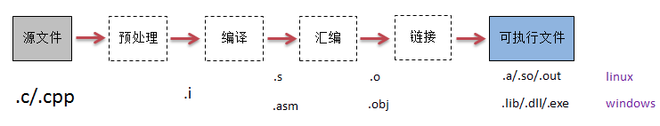

# C/C++ 编译过程



### 编译

source file >>> obj file

```sh
# 生成中间临时文件
gcc -save-temps -c -o multiply.o -v multiply.c
```

会生成中间临时文件

- .i 预编译后的源代码
- .o 编译结果，二进制机器码
- .s 或 .asm 汇编代码 (Assembly language)

常用的编译中间结果查看选项

- `-E` 查看预处理结果
- `-S` 生成汇编代码
- `-o` 小写字母o，指定输出文件
- `-O` 大写字母O，指定优化级别
- `-Wall` 启用所有的警告信息
- `-fexceptions` 启用异常处理支持。它允许 C++ 程序使用 try, catch, 和 throw 语句来处理异常
- `-g` 告诉编译器生成调试信息，生成的可执行文件里面带源代码的行号、符号映射等信息，这样后续 gdb 才能进行调试
- `-c` 只编译源文件，而不进行链接

##### 1. 预编译

处理预编译指令

```c
// 引入头文件
#include

// 定义宏
#define 

// 条件预编译
#if
#endif
```

查看预编译结果

```sh
# 只显示预编译结果
gcc -E multiply.c
```

##### 2. 编译

解析，拆成记号，抽象语法树，处理数据和指令，生成机器码

gcc默认提供了 0、1、2、3、s、z、g、fast 等多级优化选项

```sh
# 应用编译优化，可以看到编译结果obj文件和asm有变化
gcc -save-temps -O2 -c -o multiply.o -v multiply.c
```

### 链接

下面是 Code::Blocks 的编译输出，分步骤编译输出

```sh
g++ -Wall -fexceptions -g  -c /home/majianglin/Documents/XXX/main.cpp -o obj/Debug/main.o
g++ -Wall -fexceptions -g  -c /home/majianglin/Documents/XXX/test.cpp -o obj/Debug/test.o
g++  -o bin/Debug/XXX obj/Debug/main.o obj/Debug/test.o
```
